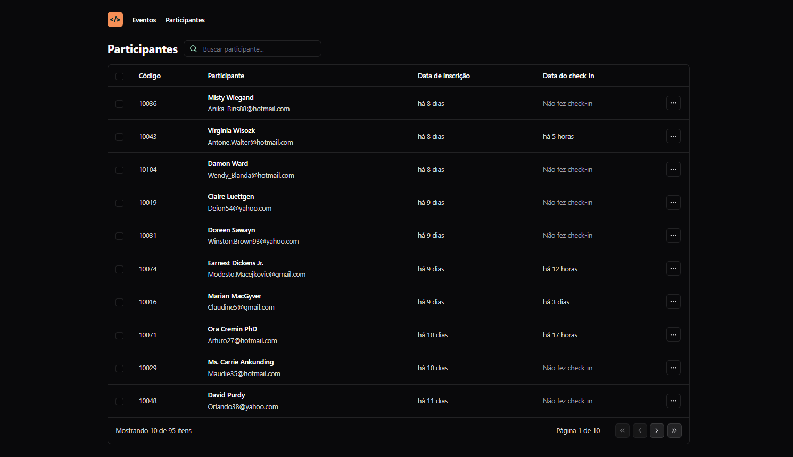

  
  <h1 align="center">NLW Unite - Trilha ReactJS</h1>

  
  
  
  
  
  

  <a href="#tecnologias">Tecnologias</a> •
  <a href="#projeto">Projeto</a> •
  <a href="#layout">Layout</a> •  
  <a href="#licenca">Licença</a>

 

  

  

## 🚀 Tecnologias

Esse projeto foi desenvolvido com as seguintes tecnologias:

- ReactJS
- Typescript
- Tailwind CSS
- Vite
- HTML
- Figma

## 💻 Projeto

Projeto de um sistema de gerenciamento de participantes para eventos presenciais desenvolvido durante o evento "NLW Unite" da Rocketseat na Trilha ReactJS.

## 🔖 Layout

Você pode visualizar o layout do projeto através [DESSE LINK](https://www.figma.com/community/file/1356738933008624188).

## 📝 Licença

Esse projeto está sob a licença MIT.
